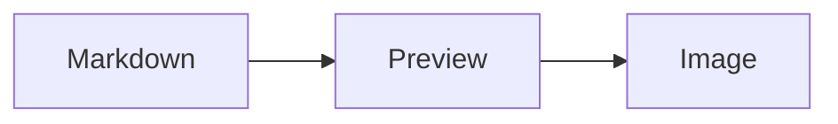

# Sharkdown 示例

这是一段 **中文、English 和 Emoji 🦈** 混排内容，适合测试导出效果。

## 功能清单

- [x] GFM 任务列表
- [x] 表格
- [x] 代码高亮
- [x] 数学公式
- [x] Mermaid 图表

| 模块 | 状态 | 说明 |
|---|---:|---|
| Markdown | 完成 | 支持常见 AI 输出 |
| Export | 完成 | 使用 Blob 主路径 |

```ts
export function hello(name: string) {
  return `Hello, ${name}`;
}
```

行内公式 $E = mc^2$，块级公式：

$$
\int_0^1 x^2 dx = \frac{1}{3}
$$


